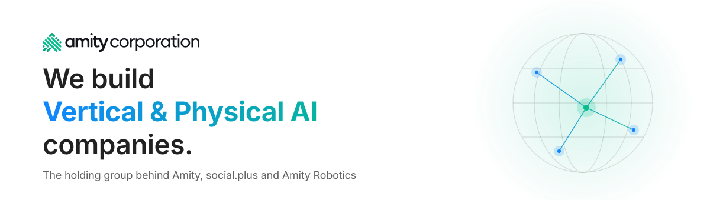

<!-- Amity Corporation — GitHub organization profile (rendered at https://github.com/amity-corp). Mirrored by the root README.md; keep both in sync, only the asset paths differ. -->

<picture>
  <source media="(prefers-color-scheme: dark)" srcset="assets/hero-dark.svg" />
  <source media="(prefers-color-scheme: light)" srcset="assets/hero-light.svg" />
  
</picture>

  
  &nbsp;
  
  &nbsp;
  

## Overview

This is the **corporate GitHub organization of Amity Corporation**, the holding group behind
[Amity](https://www.amity.co/), [social.plus](https://www.social.plus/) and
[Amity Robotics](https://www.amityrobotics.com/). Repositories here hold corporate-level and
cross-company assets: shared documentation, standards and group-wide tooling.

> ⚠️ **Confidential** — Repositories in this organization are internal unless explicitly marked public.
> Do not share code or documents externally.

## Portfolio

<table>
  <tr>
    <td align="center" valign="top" width="33%">
      <h3>Amity</h3>
      
Vertical AI models and platforms for retail and communications. The group's flagship company, operating at global scale.

      <a href="https://www.amity.co/">amity.co</a> · <a href="https://www.amitysolutions.com/">amitysolutions.com</a>
    </td>
    <td align="center" valign="top" width="33%">
      <h3>social.plus</h3>
      
SDKs and APIs for in-app social networks and communities, serving leading brands and over 100 million end users.

      <a href="https://www.social.plus/">social.plus</a>
    </td>
    <td align="center" valign="top" width="33%">
      <h3>Amity Robotics</h3>
      
Generative AI in physical spaces, with end-to-end delivery of AI-powered robots.

      <a href="https://www.amityrobotics.com/">amityrobotics.com</a>
    </td>
  </tr>
</table>

## Links

  <a href="https://www.amitycorp.com/"><b>Amity Corporation</b></a>
  &nbsp;·&nbsp;
  <a href="https://www.amitysolutions.com/"><b>Amity Solutions</b></a>
  &nbsp;·&nbsp;
  <a href="https://docs.amitysolutions.com/"><b>Product Documentation</b></a>

  🔒 Internal use only — Amity Corporation 
  © 2026 Amity Corporation. All rights reserved.

